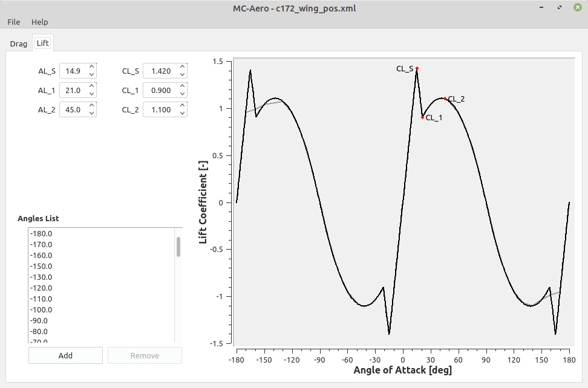

# mscsim-aero
Aerodynamic characteristics (drag coefficient and lift coefficient) approximation tool for the full range of angle of attack, based on [NASA TM-102267](https://ntrs.nasa.gov/citations/19910009728).

